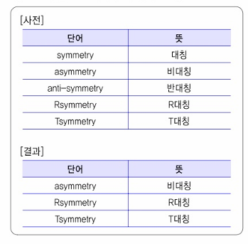
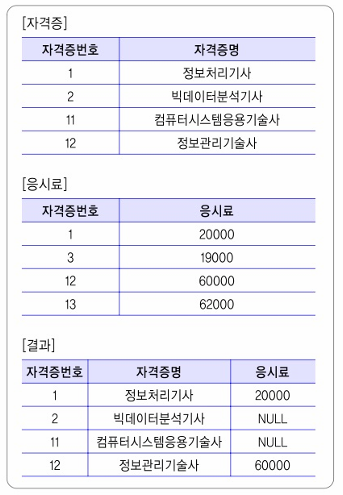
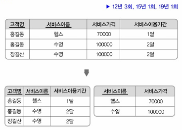

01. 프로세스 수행을 지원하는 정보 시스템의 구현을 위해 가장 선진화된 소프트웨어 아키텍쳐 서비스라고 정의되는 분할된 애플리케이션 조각들을 Loosely-coupled하게 연결해 하나의 완성된
application을 구현하기 위한 아키텍처를 무엇이라고 하는가?

02. 다음은 무선 통신 기술에 대한 설명, ()안에 들어갈 가장 적합한 용어 쓰시오.
( 1. ): 어려 개의 독립된 통신 장치가 블루투스 기술이나 UWB통신 기술을 사용하여 통신망을 형성하는 무선 네트워크 기술로 네트워크를 구성하는 장비 간에 사전에 네트워크의 정의와 계획이 
없이 상황에 따라 조정에 의하여 마스터와 슬레이브의 역할을 하면서 네트워크를 형성, 주로 수십 미터 이내의 좁은 공간에서 네트워크를 형성하는 점과 정지 또는 이동하고 있는 장치를 모두 포함하는 특징을 가지고 있다.
( 2. ): 저속 전송 속도를 갖는 홈오토메이션 및 데이터 네트워크를 위한 표준 기술로, 버튼 하나로 동작을 잡아 집안 어느 곳에서나 전등 제어 및 홈 보안 시스템 VCR on/off 등을 할 수 있고, 인터넷을 통한 전화 접속으로 홈오토메이션을 더욱 편리하게 이용하려는 것에서부터 출발한 기술이고, IEEE 802.15표준 기반, 메시 네트워크 방식을 사용하는 통신 기술이다.

03. 다음과 같은 절차로 공격을 진행하는 네트워크 공격기법은 무엇인가?
가. TCP Sequence number의 보안상 문제점 때문에 발생
나. Victim과 Server 사이의 패킷을 스니핑하여 Sequence number를 획득하고, 공겨자는 데이터 전송 중인 Victim과 Server 사이를 비동기화 상태로 강제적으로 만듦
다. 스니핑하여 획득한 Client Sequence Number를 이요하여 공격
라. 공격자는 Server에게 RST 패킷 날리고, 공격자의 새로운 Sequence number로 Server와 세션을 맺어 인증 우회, Victim 권한으로 Server 접근
마. 비동기화 상태로 패킷이 유실되어 재전송 패킷 증가
바. 이 과정에서  ACK Storm증가, NW 부하 증가

04. 다음은 정적 테스트에 대한 설명, () 안에 들어갈 용어
- 동료검토(Peer Review): 2~3명이 진행하는 리뷰의 형태로 요구사항 명세서 작성자가 요구사항 명세서를 설명하고, 이해관계자들이 설명을 들으면ㅅ 결함을 발견하는 형태로 진행하는 검토 기법
- ( 1. ): 소프트웨어 요구, 설계, 원시 코드 등의 저작자 외의 다른 전문가 또는 팀이 검사하여 오류를 찾아 내는 공식적 검토 방법
- ( 2. ): 검토 자료를 회의 전에 배포해서 사전검토한 후 짧은 시간 동안 회의를 진행하는 형태로 리뷰를 통해 오류를 검출하고 문서로 만드는 기법

05. 다음은 [사전]테이블이다. [결과]테이블처럼 'symmetry'이라는 문자열 앞에 한 글자가 추가된 문자열을 찾기위한 쿼리를 작성하시오.(symmetru, anti-symmetry와 같이 symmetry 문자열 앞에 한 글자가 추가되지 않는 문자열은 조회되지 않아야 함)

06. C언어 코드, 빈칸에 알맞은 코드를 작성
#include <stdio.h>

int add(int i, int j) {
    return i+j;
}
int sub(int i, int j) {
    return i-j;
}
int main() {
    int(*pf)(int, int);
    1. ;
    printf("%d", pf(5, 4));

    2. ;
    printf("%d", pf(5, 4));
    return 0;
}

[출력결과]
91

07. 다음은 [자격증]과 [응시료] 테이블 [자격증]과 [응시료] 테이블을 조인하여 [결과] 테이블처럼 나오도록 쿼리 작성

08. DoS(Denial of Server)공격이란 무엇인지 서술

09. 인터페이스 구현 기술 중 JSON(Javascript Object Notation)의 개념에 관해 서술

10. 요구사항 명세 단계에서 사용자의 요구를 표현할 떄 수학적인 원리와 표기법으로 서술하는 기법?

11. C언어, 출력결과
#inclcude <stdio.h>
int main() {
    int a = 30, b = 15, 
    printf("%d%d" a&b, a|b);
    return 0;
}

12. 병행 제어 미보장 시 문제점으로, 복수의 트랜잭션이 데이터 공유 시 특정 트랜잭션이 처리 취소할 경우 트랜잭션이 처리한 곳의 부분을 취소하지 못하는 오류는?

13. 다음 설명에서 ()안에 알맞은 용어를 쓰시오

- <고객명, 서비스이름>이 <서비스이용기간>에 영향을 주고, <서비스이름>이 <서비스가격>에 영향을 주는 관계를 < 1. >(이)라고 한다.
    고객명, 서비스이름 -> 서비스이용기간
    서비스이름 -> 서비스가격
- <고객명, 서비스이름, 서비스가격, 서비스이용기간>을 한테이블에 두는 것은 ( 1. )(으)로 인해 ( 2. )을/를 만족하지 못한다.
- 부분 관계인 <서비스이름, 서비스가격>관계를 별도의 테이블로 두면 ( 1. )이/가 제거되어 ( 2. )을/를 만족한다.

14. 다음은 C언어 코드, 출력 결과를 쓰시오.
#include <stdio.h>
int main() {
    char b[16] = "hello world";
    printf("%s", &b[6]);
    return 0;
}

15. SOOJEBI 테이블에 대한 DDL 문을 실행한 후에 [INSERT 문]을 삽입하는 순간 에러가 발생
[INSERT 문]이 에러가 나지 않도록 하는 DDL문을 작성.(SOOJEBI 테이블을 제거 후 생성하지 않도록 한다.)
[DDL 문]
CREATE TABLE SOOJEBI(
    SOOJEBI_NUM NUMBER(5)
);

[INSERT 문]
INSERT INTO SOOJEBI VALUES(200614);

16. 다음은 데이터 흐름도(DFD)에 대한 구성요소에 대한 설명. ()안에 들어갈 용어 쓰시오.
- ( 1. ): 입력된 데이터를 원하는 형태로 변환하여 출력하기 위한 과정으로, DFD에서는 원(○)으로 표시
- ( 2. ): DFD의 구성요소(프로세스, 데이터 저장소, 외부 엔터티)들 간의 조고받는 데이터 흐름을 나타내며, DFD에서는 화살표(→)로 표시
- ( 3. ): 데이터가 저장된 장소이고, 평행선(=)으로 표시
- 단말(Terminator): 프로세스 처리 과정에서 데이터가 발생하는 시작과 종료를 나타내고, 사각형(□)으로 표시하며, 사각형 안에는 외부 엔터티의 이름을 넣음

17. 다음은 모델링 절차에 대한 설명, () 안에 들어갈 절차를 쓰시오.
- 요구사항 분석: 현행 데이터의 문제점과 개선해야 할 점을 확인하고 향ㅇ후 개선점을 도출하는 활동
- ( 1. ): 업무 중심의 포괄적인 모델링으로 추상화하는 활동으로 주제 영역과 핵심데이터 간 관계 정의
- ( 2. ): 관계(Relationship), 속성(Attribute), 키(Key)등을 도출하는 활동
- 물리 모델링: 사용 DBMS 특성에 맞게 물리적 스키마를 만드는 활동

18. ISO/IEC 9126(ISO/ IEC 25010: 2011로 변경)의 소프트웨어 품질 특성에 대한 설명으로 ()안에 들어갈 품질 특성을 쓰시오
--------------------------------------------------------------------------------
( 1. ) - 명시된 조건에서 사용될 때 성능 수준을 유지할 수 있는 소프트웨어 제품의 능력
       - 옳고 일관된 결과를 얻기 위하여 요구된 기능을 수행할 수 있는 정도이고, 주어진   
         기능을 오류없이 수행하는 정도
       - 품질 부특성에는 성숙성, 결함 허용성, 회복성, 준수성 등이 있음
--------------------------------------------------------------------------------
( 2. ) - 명시된 조건에서 사용되는 자원의 양에 따라 요구된 성능을 제공하는 소프트웨어 제품의
         능력을 말함
       - 품질 부특성에는 시간 반응성, 자원 효율성, 준수성 등이 있음
--------------------------------------------------------------------------------

19. 다음이 설명하는 자료구조는 무엇인지 쓰시오.
- 양쪽 끝에서 삽입과 삭제를 할 수 있는 자료구조
- 두 개의 포인터를 사용하여, 양쪽의 삭제/ 삽입이 가능

20. 자바 코드, 출력 결과를 쓰시오.
class SuperObj{
    public void show() {
        print();
    }
    public void print() {
        print();
        System.out.print("Super");
    }
}

class SubObj extends SuperObj {
    public void show() {
        super.print();
    }
    public void print() {
        System.out.print("Sub");
    }
}

public class Soojebi{
    public static void main(String[] args){
        SuperObj s = new SubObj();
        s.show();
    }
}