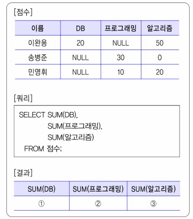

01. 다음이 설명하고 있는 통신 기술은 무엇?
- 중심주파수의 20% 이상의 점유 대역폭을 가지는 신호, 또는 점유 대역폭과 상관없이 500MHz 이상의 대역폭을 갖는 신호와 수 GHz대의 초광대역을 사용하는 초고속의 무선 데이터 전송 기술로서 OFDM 변조 방식 및 직접 시퀀스 확산 스펙트럼 방식 등을 사용
- 빠른 속도 (500Mbps/ 1Gbps)와 저전력 특성이 있고, 평균 10~ 20m, 최대 100m의 근거리 개인 무선 통신망(WPAN)에서 PC와 주변기기 및 가전제품들을 초고속 무선 인터페이스로 연결하거나 벽 투시용 레이더, 고정 밀도의 위치 측정, 차량 충돌 방지 장치, 신체 내부 물체 탐지 등 여러 분야에서 활동 가능

02. ()은/는 스마트폰 이용자가 도난당한 스마트폰의 작동을 웹사이트를 통해 정지할 수 있도록 하는 일종의 자폭 기능으로 스마트폰의 유통, 도난이나 분실을 어느정도 막을 수 있는 기능 원격 잠김, 개인 정보 삭제 기능 등이 있으며, 단말기의 펌웨어나 운영체제에 탑재. () 안에 들어갈 가장 적합한 용어를 쓰시오.

03. 다음 ()안에 들어갈 올바를 용어를 쓰시오.
개발자 혹은 시험자의 시각으로 소프트웨어가 명세화된 기능을 올바로 수행하는지 알아보는 과정으로 소프트웨어 개발 과정을 테스트하는 것은 ( 1. )(이)라고 하고, 사용자 시각으로 올바른 소프트웨어가 개발되었는지 입증하는 과정으로 소프트웨어 결과를 테스트하는 것은 ( 2. )(이)라고 한다.

04. 자료 사전(Data Dictionary; DD)의 작성 목적은 무엇인지 서술하시오.

05. 다음[점수] 테이블에 대해 쿼리를 수행한 결과는 [결과]테이블과 같다. 1, 2, 3에 들어갈 값을 쓰시오.

06. 파이썬 코드, 출력 결과를 쓰시오.
i = 0
sum = 0
while i < 10:
    i = i+1
    if i % 3 == 0:
        sum -= i
    elif i % 3 == 1:
        sum += i
    elif:
        sum *= i

print(sum)

07. 인증(Authentication) 기술 중 () 기반 인증은 사용자가 기억하고 있는 ()(으)로 사례로는 ID, 패스워드가 있다. ()안에 공통으로 들어갈 용어를 쓰시오.

08. 다음은 서버 프로그램 구현을 위한 주요 개념이다. ()안에 들어갈 용어를 쓰시오.
(    )은/는 사용자와 만나지 않고 프론트엔드(Front-end)와 연동하여 핵심 로직을 처리하는 영역으로 DB나 인터페이스를 통해서 시스템에 접근하여 처리

09. 데이터베이스의 트랜잭션(Transaction)에 대해 서술하시오.

10. 데이터베이스 관리자가 권한을 회수하는 DCL문을 작성하시오.
관리자가 사용자 신민아에게 DEPT 테이블에 대해 INSERT 할 수 있는 권환을 회수

11. Java 언어 코드, 코드를 수행한 결과가 [출력결과]와 같도록 1, 2에 들어갈 코드를 쓰시오
public class Soojebi{
    public static void main(Stirng[] args){
        int[] arr = {10, 30, 50, 70, 90};
        int i, max, min;
        max = arr[0];
        min = arr[0];
        for(i=0; i < 5; i++){
            if( 1. > max)
                max = arr[i];
            if( 2. < min)
                min = arr[i];
        }
        System.out.pritf("%d %d \n", max, min);
    }
} 
[출력 결과]
90 10

12. 다음이 설명하는 EAI구축 유형은 무엇인가?
- 단일한 접점의 허브 시스템을 통하여 데이터를 전송하는 중앙 집중식 방식
- 허브 장애 시 전체 장애 발생

13. 데이터를 데이터베이스에 저장할 때 불필요하게 중복되어 릴레이션 조작 시 예기치 못한 곤란한 현상이 발생하는 현상은 무엇인가?

14. 다음은 c언어 코드이다. 출력 결과를 쓰시오

15. '학생'이라는 뷰를 삭제하는 쿼리를 작성하시오.

16. 다음은 스크럼(SCRUM) 기법에 대한 설명이다. ( ) 안에 들어갈 용어를 쓰시오.
백로그(Backlog)는 제품과 프로젝트에 대한 요구사항이고, ( 1. )은/는 2 ~ 4주의 짧은 개발 기간을 지칭한다. 또한 ( 2. )은/는 남아있는 백로그 대비 시간을 그래픽적으로 표현한 차트이다.

17. 방화벽(Fiirewall)이 무엇인지 서술하시오.

18. 다음은 페이지 교체 기법의 유형이다. () 안에 들어갈 기법을 쓰시오.
- ( 1. ): 사용된 시간을 확인하여 가장 오랫동안 사용되지 않은 페이지를 선택하여 교체하는 기법으로 최근에 참조된 페이지는 앞으로도 참조되지 않을 가능성이 크다는 전제로 구현된 기법
- ( 2. ): 사용된 횟수를 확인하여 참조 횟수가 가장 적은 페이지를 선택하여 교체하는 기법으로 기억장치에 저장된 페이지 중에서 사용한 횟수가 가장 적은 페이지를 교체하는 기법

19. 다음 설명 중 () 안에 들어갈 알맞은 용어를 쓰시오.

- <개발자>마다 <자격증> 값들이 여러 개 존재하고, 특정 <개발자>마다 <언어> 값들이 여러 개 존재하는 경우 다치 종속 관계라고 한다.
- <개발자> 별로 여러 <자격증> 값을 가지고 있고, <개발자> 별로 여러 <언어> 값을 가지고 있으므로 <개발자, 자격증>, <개발자, 언어> 테이블로 분리하여 관리하면 다치 종속 관계를 제거하기 때문에 (      )을/를 만족

20. C언어 코드, 출력 결과를 쓰시오.
#include <stdio.h>
void fn(int *c, int *d){
    int temp=0;
    temp = *c;
    *c = *d;
    *d = temp;
}
int main() {
    int a=10;
    int b=5;
    fn(&a, &b);
    printf("%d %d\n", a, b);
}

