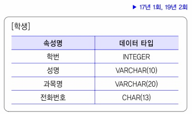
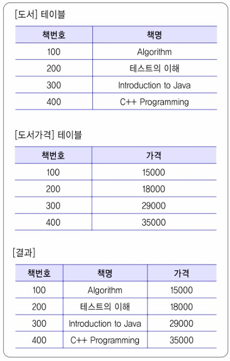

01. 다음 () 안에 들어갈 가장 올바른 용어를 쓰시오.
- ( 1. )은/는 데이터의 한 부분으로서 특정 사용자가 관심을 갖는 데이터들을 담은 비교적 작은 규모의 ( 2. )이다. 일반적인 데이터베이스 형태를 갖고 있는 다양한 정보를 사용자의 요구 항목에 따라 체계적으로 분석하여 기업의 경영 활동을 돕기 위한 시스템을 말한다. 전체적인 ( 2. )에 있는 일부 데이터를 가지고 특정 사용자를 대상으로 한다.
- ( 2. )은/는 급증하는 다량의 데이터를 효과적으로 분석하여 정보화하고 이를 여러 계층의 사용자들이 효율적으로 사용할 수 있도록한 데이터베이스이다. 다양한 원본 데이터베이스로부터 정제되어 추출된 데이터만을 저장, 필요한 인덱스를 생성하고, 데이터의 다차원 분석 도구로 분석하여 효율적인 의사결정에 필요한 자료를 얻는다.

02. 트랜잭션에서 사용하는 로킹(Locking)기법의 개념에 대해 서술하시오.

03. 다음이 설명하는 IoT관련 프로토콜은 무엇인지 쓰시오.
- IoT 장치, 텔레메트리 장치 등에서 최적화되어 사용할 수 있도로 ㄱ개발된 프로토콜로, 브로커를 사용한 Pubilsh/Subscribe 방식의 라이트 메시징을 전송하는 프로토콜
- 저전력 센서, 스위치, 밸브 등의 기기에 대한 표준적 인터넷 환경을 지원하고, 프로토콜 리소스 점유 최소화, 한정된 자원 시스템 지원하는 특징이 있음

04. 다음은 [학생] 테이블 스키마에 대한 명세이다. [학생] 테이블이세ㅓ 학번이 '202101'이고, 성명은 '임꺽정', 과목은 '프로그래밍', 전화번호는'010-1234-567'인 학생의 정보를 입력하시오.

05. 다음은 공유 매체에 대한 다중 접근 방식에 대한 설명이다. () 안에 들어갈 용어를 쓰시오.
- ( 1. )은/는 IEEE802.3  유선 LAN의 반이중방식(Half Duplex)에서, 각 단말이 신호 전송 전에 현재 채널이 사용 중인지 체크하여 전송하는 매체 액세스 제어(MAC)방식이다.
- ( 2. )은/는 무선 LAN의 반이중방식(Hafl Duplex)에서, 사전에 가능한 충돌은 회피(Collision Avoidance)하는 무선전송 다원접속 방식이다.

06. C언어코드, 출력 결과를 쓰시오
#include <stdio.h>
#include <stdlib.h>
int main() {
    char str[8] = "2021";
    int num = atoi(str);
    printf("%d", num + 2);
    return 0;
}

07. 다음이 설명하는 보안 솔루션은 무엇인가?
- 메일 서버 앞단에 위치하여 프록시(Proxy) 메일 서버로 동작
- 메일 바이러스 검사, 내부 -> 외부 본문 검색 기능 통한 내부 정보 유출 방지

08. 다음은 비즈니스 연속성 계획과 관련한 주요 용어이다. 아래에서 설명하는 용어를 쓰시오.
- 업무중단 시점부터 데이터가 복구되어 정상 가동 될 때 데이터의 손실 허용 시점
- 재해 시 복구 목표 지점의 선정

09. 주어진 '도서'테이블과 '도서가격'테이블을 내부 조인(Inner Join)하는 SQL문을 작성하시오.

10. 다음이 설명하는 가장 적합한 라우팅 알고리즘은 무엇인가?
- 인접 라우터오 ㅏ정보를 공유하여 목적지까지의 거리와 방향을 결정하는 라우티 ㅇ프로토콜 알고리즘
- 벨만-포드(Bellman-Ford) 알고리즘 사용

11. 파이썬 코드, 풀력 결과를 쓰시오.
def soojebi(begin, diff, n):
    cnt = 1
    ret = begin
    while True:
        cnt += 1
        ret *= diff
        if cnt ==n:
        return ret

print(soojebi(1, 3, 4))

12. 디지털 저작권 관리를 위한 요소 중 소비자와 유통업자 사이에 발생하는 거래에 대해 디지털 저작권 라이선싱을 중개하고 라이선스 발급을 수행하는 정산소를 무엇이라고 하는가?

13. 데이터베이스 시스템에서 삽입, 갱신, 삭제 등의 이벤트가 발생할 때마다 관련 작업이 자동으로 수행되는 절차형 SQL은 무엇인가?

14. 자바 코드, 출력 결과를 쓰시오.
class Parent{
    String name="Parent";
    public Parent() {
        System.out.print("P : " + this.naem);
    }
    public Parent(String name){
        this.name = name;
        System.out.print("P(Stirng) : " + this.name);
    }
}
class Child extends Parent{
    int num;
    public Child(String name, int num){
        super(name);
        this.num = num;
    }
    void info(){
        System.out.print(num);
    }
}
public class Soojebi{
    public static void main(Stirng[] args) {
        Child c = new Child("Soojebi", 2021);
        c.info();
    }
}

15. 다음 사원 테이블 스키마를 보고, 사원 테이블에서 성별 값이 'M'을 가진 사원의 사번, 이름을 출력하는 '사원뷰'라는 이름의 뷰를 생성하는 쿼리를 작성하시오.
사원 테이블(사번(primary), 업무, 이름, 생년월일, 성별, 입사일)

16. 다음이 설명하는 객체지향 설계원칙은 무엇인가?
- 실제 사용 관계를 바뀌지 않으며, 추상을 매개로 메시지를 주고받음으로써 관계를 최대한 느슨하게 만드는 원칙

17. 다음은 그래프의 유형에 대한 설명이다. 가장 올바른 그래프의 유형을 쓰시오.

18. 리누스 토발즈가 2005년 리눅스 커널의 개발을 위해 만든 시스템으로 중앙 집중형 방식이 아닌 분산형 방식으로 각 PC 스스로 완전한 저장소가 구성되며, 필요에 따라 중앙 집중형 방식으로 운영할 수 있는 형상 관리시스템은 무엇인가?

19. 지역성의 유형 중 ()은/는 프로세스 실행 시 일정 위치의 페이지를 집중적으로 액세스하는 현상으로 참조된 메모리 근처의 메모리를 참조하는 특성과 사례로는 배열 순회가 있다. () 안에 들어갈 유형을 쓰시오.

20. 자바 코드, 실행결과를 쓰시오.
public class Soojebi {
    public static void main(String[] args){
        int i=0, sum=0;
        while(i<10){
            i++;
            if(i%2 == 1)
                continue;
            sum += i;
        }
        System.out.print(sum);
    }
}